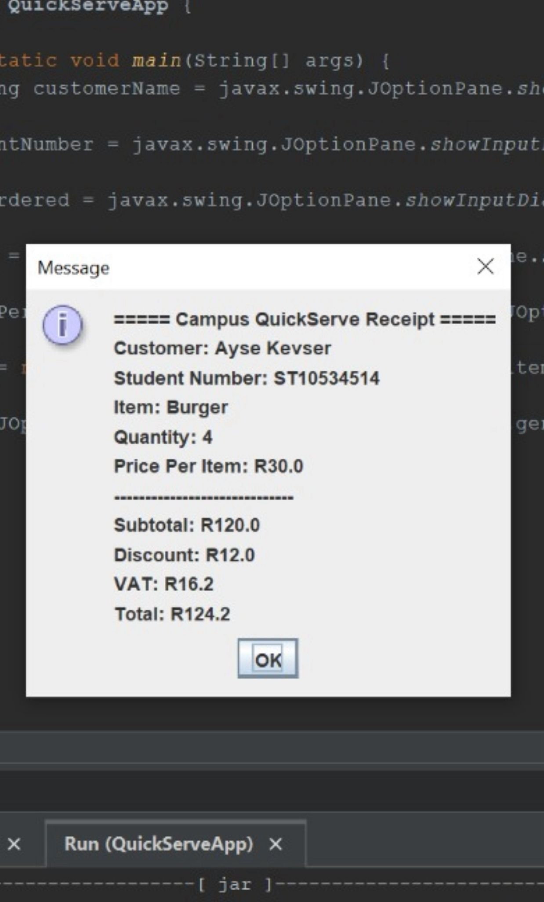

# Campus QuickServe ICE

## Problem Description
This Java application simulates a campus food vendor system. It collects customer details, processes an order, calculates totals, and displays a formatted receipt using JOptionPane.

## Program Structure
Classes used:
- QuickServeApp (Main class)
- Order (Handles calculations and receipt generation)

Methods used:
- calculateSubtotal()
- calculateDiscount()
- calculateVAT()
- calculateTotal()
- generateReceipt()

## How I Approached the Problem
The program collects input using JOptionPane dialogs. An Order object is created and calculation methods determine subtotal, discount, VAT and total. The final receipt is displayed using a GUI dialog.

## OOP Concepts Used
- Class vs Object
- Encapsulation (private variables + getters)
- Constants (VAT_RATE)
- Methods for calculations

## Screenshot

## Author
Ayse Kevser Erdogan
